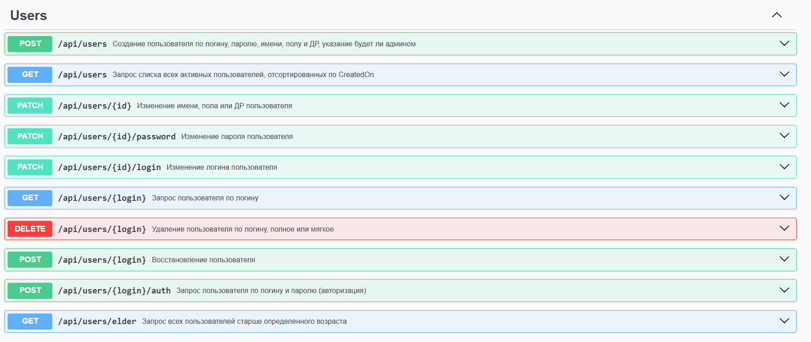

# Задание
Написать Web API сервис на .NET 9 или выше, реализующий API методы CRUD над сущностью Users, доступ к API должен осуществляться через интерфейс Swagger.

Выбрана платформа .NET 9. В качестве базы данных использовалась БД PostgreSQL, развернутая в docker-контейнере. Для развертывания могут быть использованы [скрипты](./Deploy).

Реализована аутентификация по JWT-токену.

Пользовательпо умолчанию (администратор) создается с логином и паролем "admin".

CRUD методы контроллера UsersController:
1. Создание пользователя по логину, паролю, имени, полу и дате рождения, указание будет ли пользователь админом (Доступно Админам)
2. Изменение имени, пола или даты рождения пользователя (Может менять Администратор, либо лично пользователь, если он активен (отсутствует RevokedOn))
3. Изменение пароля (Пароль может менять либо Администратор, либо лично пользователь, если он активен (отсутствует RevokedOn))
4. Изменение логина (Логин может менять либо Администратор, либо лично пользователь, если он активен (отсутствует RevokedOn), логин должен оставаться уникальным)
5. Запрос списка всех активных (отсутствует RevokedOn) пользователей, список отсортирован по CreatedOn (Доступно Админам)
6. Запрос пользователя по логину, в списке должны быть имя, пол и дата рождения, статус: активный или нет (Доступно Админам)
7. Запрос пользователя по логину и паролю (Доступно только самому пользователю, если он активен (отсутствует RevokedOn))
8. Запрос всех пользователей старше определённого возраста (Доступно Админам)
9. Удаление пользователя по логину полное или мягкое (При мягком удалении должна происходить простановка RevokedOn и RevokedBy) (Доступно Админам)
10. Восстановление пользователя - Очистка полей (RevokedOn, RevokedBy) (Доступно Админам)

Поля сущности User
- Guid - Guid - Уникальный идентификатор пользователя
- Login - string - Уникальный Логин (запрещены все символы кроме латинских букв и цифр),
- Password - string - Пароль(запрещены все символы кроме латинских букв и цифр),
- Name - string - Имя (запрещены все символы кроме латинских и русских букв)
- Gender - int - Пол 0 - женщина, 1 - мужчина, 2 - неизвестно
- Birthday - DateTime? - поле даты рождения может быть
- Admin - bool - Указание - является ли пользователь админом
- CreatedOn - DateTime - Дата создания пользователя
- CreatedBy - string - Логин Пользователя, от имени которого этот пользователь создан
- ModifiedOn - DateTime - Дата изменения пользователя
- ModifiedBy - string - Логин Пользователя, от имени которого этот пользователь изменён
- RevokedOn - DateTime- Дата удаления пользователя
- RevokedBy - string - Логин Пользователя, от имени которого этот пользователь удалён
